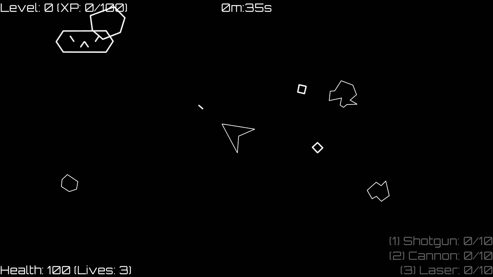
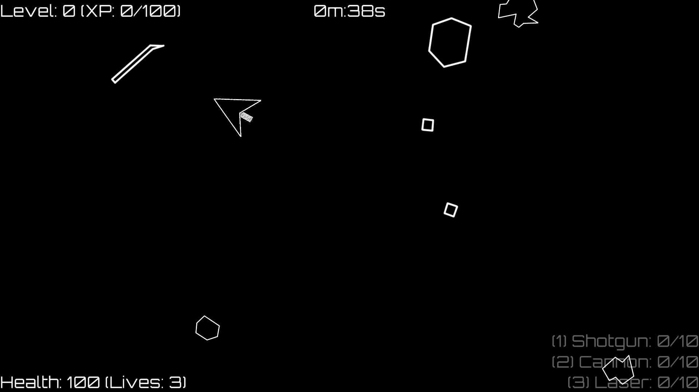
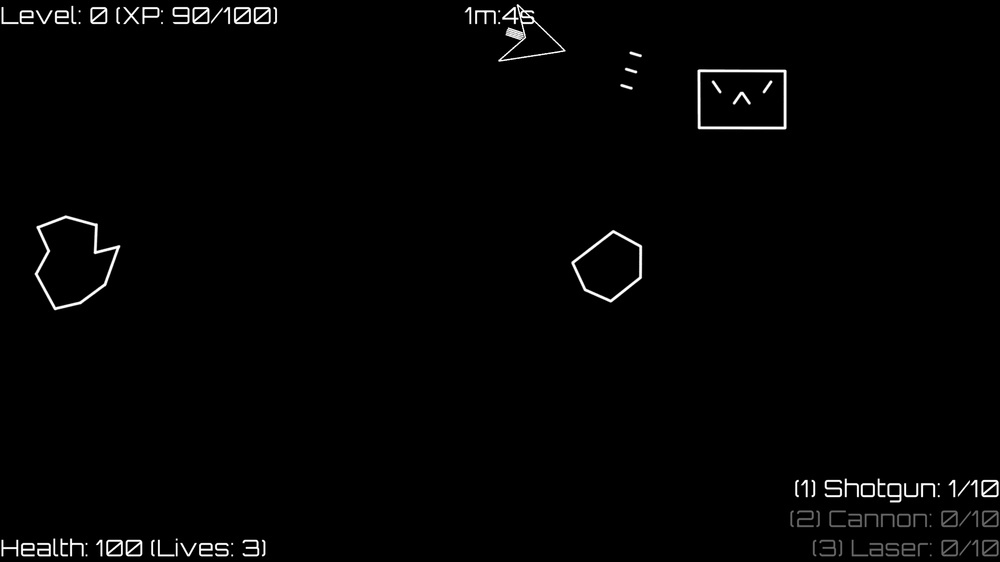

# Astrocats

A Unity Asteroids clone, but with cats.

[willswats.itch.io/astrocats](https://willswats.itch.io/astrocats)

## Table of Contents

<!--toc:start-->

- [General Information](#general-information)
- [Controls](#controls)
- [Screenshots](#screenshots)
<!--toc:end-->

## General Information

The gameplay is similar to Asteroids with a few additions, this includes; new enemies, as well as aspects from Role-playing games, such as XP and weapon upgrades. The goal of the game is to get to level 5 in as short a time as possible, to gain XP you must destroy asteroids and pick up their points. Levelling up will increase the speed of your ship, helping you to survive. As you play the game, the difficulty will increase, therefore, it is a good idea to upgrade your weapons by picking up the same ones over and over, the weapons are dropped by the Astrocats (enemies).

## Controls

- Escape (must be pressed twice if game is full screened) or p to pause
- WASD or arrow keys for movement.
- Hold space or left mouse button to fire.
- 1, 2, and 3 to change weapons (once acquired).

## Screenshots

